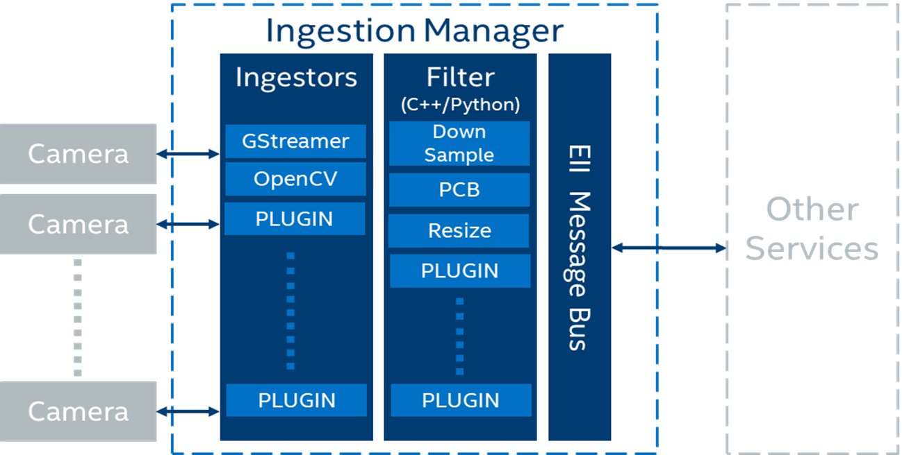

# Contents

- [Contents](#contents)
  - [VideoIngestion module](#videoingestion-module)
  - [Configuration](#configuration)
    - [Ingestor config](#ingestor-config)
  - [VideoIngestion features](#videoingestion-features)
    - [Image ingestion](#image-ingestion)
    - [UDF configurations](#udf-configurations)
    - [Camera configurations](#camera-configurations)
      - [GenICam GigE or USB3 cameras](#genicam-gige-or-usb3-cameras)
        - [Prerequisities for working with the GenICam compliant cameras](#prerequisities-for-working-with-the-genicam-compliant-cameras)
      - [USB cameras](#usb-cameras)
      - [RealSense Depth cameras](#realsense-depth-cameras)
  
## VideoIngestion module

The VideoIngestion (VI) module ingests the video frames from video sources in the OEI stack for processing. The example of video sources include video files or cameras such as Basler, RTSP, or USB cameras. The VI module can also perform video analytics, when it runs with the classifier and post-processing user defined functions (UDFs).



The high-level logical flow of the VideoIngestion pipeline is as follows:

1. The app reads the application configuration via the Configuration Manager which has details of the `ingestor`, `encoding`, and `UDFs`.
2. Based on the ingestor configuration, the app reads the video frames from a video file or camera.
3. [`Optional`] The read frames are passed to one or more chained native or python UDFs for doing any pre-processing. Passing through UDFs is optional and it is not required to perform any pre-processing on the
   ingested frames. With chaining of UDFs supported, you also have classifier UDFs and any post-processing UDFs like resize etc., configured in the `udfs` key to get the classified results. For more details, refer to the [../common/video/udfs/README.md](https://github.com/open-edge-insights/video-common/blob/master/udfs/README.md).
4. App gets the msgbus endpoint configuration from system environment. Based on the configuration, the app publishes data on the mentioned topic on the MessageBus.

> **Note:**
>
> The following use cases are suitable for a single node deployment, where the overhead of the VideoAnalytics (VA) service can be avoided:
>
> - The VA service is not required, when the VI service is configured with a UDF that does the classification. The VI service uses multiple UDFs for pre-processing, classification, and post-processing.
> - The VA service is not required, when the VI service uses the Gstreamer Video Analytics (GVA) elements. Pre-processing, classification, and post-processing (using the vappi gstreamer elements) can be done in the gstreamer pipeline. If required, you can configure post-processing by having multiple UDFs in the VI service.

## Configuration

For configuration details refer the following topics:

- [UDFs configuration](https://github.com/open-edge-insights/video-common/blob/master/udfs/README.md)
- [Etcd secrets configuration](https://github.com/open-edge-insights/eii-core/blob/master/Etcd_Secrets_Configuration.md) and
- [MessageBus configuration](https://github.com/open-edge-insights/eii-core/blob/master/common/libs/ConfigMgr/README.md#interfaces) respectively.
- [JSON schema](schema.json)

All the app module configurations are added to the distributed key-value store under the `AppName` env, as mentioned in the environment section of the app's service definition in the `docker-compose`. If the `AppName` is `VideoIngestion`, then the app's config is taken from the `/VideoIngestion/config` key via the OEI Configuration Manager.

> **Note:**
>
> - The Developer mode-related overrides goes in the `docker-compose-dev.override.yml` file.
> - For the `jpeg` encoding type, `level` is the quality from `0 to 100`. A higher value means better quality.
> - For the `png` encoding type, `level` is the compression level from `0 to 9`. A higher value means a smaller size and longer compression time.
> - Use the [JSON validator tool](https://www.jsonschemavalidator.net/) for validating the app configuration for the schema.

### Ingestor config

OEI supports the following type of ingestors:

- [OpenCV](https://opencv.org/)
- [GStreamer](docs/gstreamer_ingestor_doc.md)
- [RealSense](https://www.intelrealsense.com/)
  
For more information on the Intel RealSense SDK, refer to [librealsense](https://github.com/IntelRealSense/librealsense).

## VideoIngestion features

Refer the following to learn more about the VideoIngestion features and supported camera:

- [Generic server](docs/generic_server_doc.md)
- [Gstreamer video analytics](docs/gva_doc.md)
- [Run GVA elements in VI or VA](models/README.md)
- [GenICam GigE/USB3.0 camera support](#genicam-gige-or-usb3-camera)
- [RTSP camera support](#rtsp-camera)
- [USB camera support](#usb-camera)

### Image ingestion

The Image ingestion feature is mainly responsible for ingesting the images coming from a directory into the OEI stack for further processing. The `OpenCV Ingestor` supports image ingestion.
Image ingestion supports the following image formats:

- Jpg
- Jpeg
- Jpe
- Bmp
- Png

Refer the following snippet for configuring the [config.json](./config.json) file for enabling the image ingestion feature.

- OpenCV Ingestor

  ```javascript
  {
   //
    "ingestor": {
    "type": "opencv",
    "pipeline": "/app/img_dir/",
    "poll_interval": 2,
    "loop_video": true,
    "image_ingestion": true
  },
    "sw_trigger": {
        "init_state": "running"
    },
    "max_workers":1,
      //
  }
  ```

The description of the keys used in the `config.json` file is as follows:

- pipeline — Provides the path to the images directory that is volume mounted.
- poll_interval — Refers to the pull rate of image in seconds. Configure the `poll_interval` value as required.
- loop_video — Would loop through the images directory.
- image_ingestion — Optional boolean key. It is required for enabling the image ingestion feature.

  > **Note:**
  >
  > - The image_ingestion key in the `config.json` needs to be set true for enabling the image ingestion feature.
  > - Set the `max_workers` value to 1 as `"max_workers":1` in the `config.json` files for [VideoIngestion/config.json](./config.json) and [VideoAnalytics/config.json](https://github.com/open-edge-insights/video-analytics/blob/master/config.json). This is to ensure that the images sequence is maintained. If the `max_workers` is set more than 1, then more likely the images would be out of order due to those many multiple threads operating asynchronously.
  > - If the resolution of the image is greater than `1920×1200`, then the image will be resized to `width = 1920` and `height = 1200`. The image is resized to reduce the loading time of the image in the WebVisualier and the native Visualizer.  

Volume mount the image directory present on the host system. To do this, provide the absolute path of the images directory in the `docker-compose file`.
Refer the following snippet of the `ia_video_ingestion` service to add the required changes in the [docker-compose.yml](./docker-compose.yml) file. After making the changes, ensure that the [builder.py](https://github.com/open-edge-insights/eii-core/blob/master/build/builder.py) is executed before you build and run the services.

```yaml
ia_video_ingestion:
  ...
  volume:
    - "vol_eii_socket:${SOCKET_DIR}"
    - "/var/tmp:/var/tmp"
    # Add volume
    # Please provide the absolute path to the images directory present in the host system for volume mounting the directory. Eg: -"home/directory_1/images_directory:/app/img_dir" 
    - "<path_to_images_directory>:/app/img_dir"
    ...
```

### UDF configurations

Ensure that you are using the appropriate UDF configuration for all the video and camera streams. If the UDF is not compatible with the video source then you may not get the expected output in the Visualizer or the Web Visualizer screen. Use the `dummy` udf, if you are not sure about the compatibility of the UDF and a video source. The dummy UDF will not do any analytics on the video and it will not filter any of the video frames. You will see the video streamed by the camera, as it is displayed on the video output screen in the Visualizer or WebVisualizer.

> Refer the following configuration for the 'dummy' UDF:

  ```javascript
    "udfs": [{
        "name": "dummy",
        "type": "python"
    }]
  ```
>  
> Apply the same changes in the VideoAnalytics configuration, if it is subscribing to VideoIngestion.

### Camera configurations

The camera configurations for the VI module is as follows:

- For a video file

  - OpenCV Ingestor

  ```javascript
  {
    "type": "opencv",
    "pipeline": "./test_videos/pcb_d2000.avi",
    "poll_interval": 0.2
    "loop_video": true
  }
  ```

  - Gstreamer Ingestor

  ```javascript
  {
    "type": "gstreamer",
    "pipeline": "multifilesrc loop=TRUE stop-index=0 location=./test_videos/pcb_d2000.avi ! h264parse ! decodebin ! videoconvert ! video/x-raw,format=BGR ! appsink"
  }
  ```

For more information or configuration details for the `multifilesrc` element, refer to the [docs/multifilesrc_doc.md](docs/multifilesrc_doc.md).

#### GenICam GigE or USB3 cameras

For more information or configuration details for the GenICam GigE or the USB3 camera support, refer to the [GenICam GigE/USB3.0 Camera Support](docs/generic_plugin_doc.md).

##### Prerequisities for working with the GenICam compliant cameras

The following are the prerequisites for working with the GeniCam compliant cameras.
> Note
>
> For other cameras such as RealSense, RSTP, and USB (v4l2 driver compliant) revert the changes that are mentioned in this section. Refer to the following snip of the `ia_video_ingestion` service, to add the required changes in the [docker-compose.yml](./docker-compose.yml) file of the respective ingestion service (including custom udf services). After making the changes, before you build and run the services, ensure to run the [builder.py](https://github.com/open-edge-insights/eii-core/blob/master/build/builder.py).

- For GenICam GigE cameras:

```yaml
ia_video_ingestion:
  # Add root user
  user: root
  # Add network mode host
  network_mode: host
  # Please make sure that the above commands are not added under the environment section and also take care about the indentations in the compose file.
  ...
  environment:
  ...
    # Add HOST_IP to no_proxy and ETCD_HOST
    no_proxy: "${RTSP_CAMERA_IP},<HOST_IP>"
    ETCD_HOST: "<HOST_IP>"
  ...
  # Comment networks section as below as it will throw an error when network mode host is used.
  # networks:
    # - eii
  # Comment ports section as below
  # ports:
  # - 64013:64013
```
  
For GenIcam USB3.0 cameras:

```yaml
ia_video_ingestion:
  # Add root user
  user: root
  ...
  environment:
    # refer [GenICam GigE/USB3.0 Camera Support](docs/generic_plugin_doc.md) to install trespective camera SDK
    # Setting GENICAM value to the respective camera/GenTL producer which needs to be used
    GENICAM: "<CAMERA/GenTL>"
  ...
```

> **Note:**
>
> - If the GenICam cameras doesn't get initialized during the runtime, then on the host system, run the `docker system prune` command. After that, remove the GenICam specific semaphore files from the `/dev/shm/` path of the host system. The `docker system prune` command will remove all the stopped containers, networks that are not used (by at least one container), any dangling images, and build cache which could prevent the plugin from accessing the device.
> - If you get the `Feature not writable` message while working with the GenICam cameras, then reset the device using the camera software or using the reset property of the Generic Plugin. For more information, refer the [README](src-gst-gencamsrc/README.md).
> - In the `IPC` mode, if the Ingestion service is running with the `root` privilige, then the `ia_video_analytics` and `ia_visualizer` service subscribing to it must also run with the `root` privileges.
> - In a multi-node scenario, replace <HOST_IP> in "no_proxy" with the leader node's IP address.
> - In the TCP mode of communication, the msgbus subscribers and clients of VideoIngestion are required to configure the "EndPoint" in the config.json file with the host IP and port under the `Subscribers` or `Clients` interfaces section.

- For the Gstreamer ingestor, refer the following:

  - GenICam GigE/USB3.0 cameras

  > For more information or configuration details on RTSP simulated cameras, refer to [docs/rtsp_doc.md](docs/rtsp_doc.md).

#### USB cameras

For information or configurations details on the USB cameras, refer to [docs/usb_doc.md](docs/usb_doc.md).

- OpenCV Ingestor

  ```javascript
      {
        "type": "opencv",
        "pipeline": "/dev/video0"
      }
  ```

- Gstreamer Ingestor

  ```javascript
      {
        "type": "gstreamer",
        "pipeline": "v4l2src ! video/x-raw,format=YUY2 ! videoconvert ! video/x-raw,format=BGR ! appsink"
      }
  ```

#### RealSense Depth cameras

- `RealSense Ingestor`

  ```javascript
       "ingestor": {
            "type": "realsense",
            "serial": "<DEVICE_SERIAL_NUMBER>",
            "framerate": <FRAMERATE>,
            "imu_on": true
        },
  ```

    > **Note**
    >
    > - RealSense Ingestor was tested with the Intel RealSense Depth Camera D435i
    > - RealSense Ingestor does not support poll_interval. If required, use framerate to reduce the ingestion FPS.
    > - If the `serial` config is not provided then the first RealSense camera in the device list will be connected.
    > - If the `framerate` config is not provided then the default framerate of `30` will be applied. Ensure that the framerate provided is compatible with both the color and depth sensor of the RealSense camera. With the D435i camera only framerate 6,15,30, and 60 is supported and tested.
    > - The IMU stream will work only if the RealSense camera model supports the IMU feature. The default value for `imu_on` is set to `false`.


